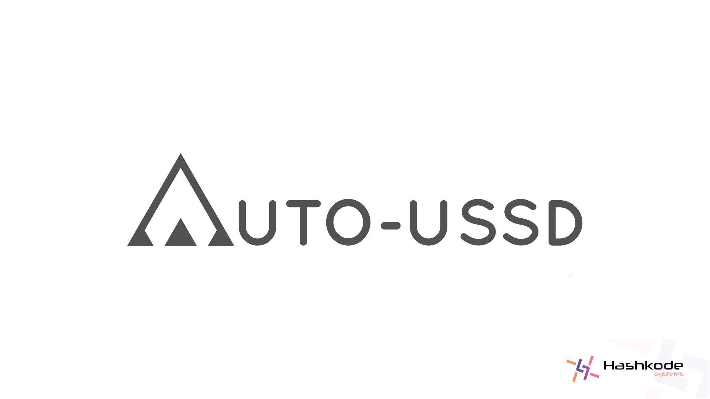

# AutoUssd

    

[**AutoUssd**](https://autoussd.com) is a powerful automation SDK which allows you to build Android applications on top of **[USSD](https://www.techtarget.com/searchnetworking/definition/USSD)** services. Visit our [documentation](https://autoussd.com/docs) to get started.

